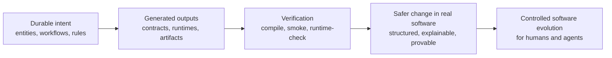
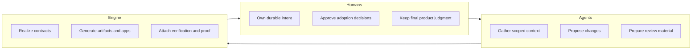

# Topogram

Topogram helps humans and agents evolve software safely.

It keeps intent, generated outputs, and verification aligned so software changes stay structured, explainable, and provable instead of drifting across prompts, code, and docs.

Topogram is a spec-and-proof layer for controlled software evolution. It models the parts that should stay durable, generates contracts and runnable artifacts from that model, and keeps verification attached to the same source of truth.



## Why Topogram

Teams are starting to use agents to change real software. The hard part is no longer “can the model write code?” The hard part is whether the change keeps architecture, workflow semantics, and verification aligned.

Topogram gives humans and agents a system to work within:

- explicit domain and workflow models
- projections for API, UI, and persistence
- generated contracts, schemas, scaffolds, and runnable artifacts
- verification that stays attached to the modeled intent
- a clear boundary between modeled surfaces and hand-maintained code

The goal is not to replace engineering judgment. The goal is to give judgment a durable home, so agents can help evolve software without turning the system into prompt-shaped drift.

## Why Now

Agent use is increasing, but prompt-driven software work tends to scatter intent across chats, generated diffs, and partial runtime checks.

Topogram exists for teams that want:

- a durable source of product and workflow intent
- explicit boundaries around what should be generated vs hand-maintained
- emitted contracts that humans can audit
- proof that generated and maintained surfaces still line up after change

## What It Is

Topogram is not just a schema tool and not just an app generator.

It is a way to capture durable software intent so humans and agents can:

- model domain concepts, workflows, rules, and decisions
- generate contracts, runtime bundles, and reference apps from shared structure
- verify modeled behavior through compile, smoke, and runtime checks
- recover structure from existing systems through brownfield import and reconciliation
- evolve hand-maintained apps with a clearer model-driven change boundary

## Human And Agent Workflow

Topogram works best when the collaboration layers stay clear:

- humans own durable intent such as entities, capabilities, rules, workflows, journeys, and adoption decisions
- agents work from scoped context, candidate imports, draft docs, reconcile reports, and adoption plans
- the engine owns canonical realization and proof outputs such as contracts, apps, verification, diffs, digests, and bundles

The default operating model is:

1. humans define or approve durable meaning
2. agents propose changes or gather scoped context
3. the engine realizes contracts, generated artifacts, and proof
4. humans review and adopt semantic changes deliberately

The current planning boundary is now explicit too:

- `query next-action` is the minimal pointer
- `query single-agent-plan` is the default operating loop for one agent or operator
- `query multi-agent-plan --mode import-adopt` is the optional decomposition for more complex brownfield work
- `query work-packet --mode import-adopt --lane <id>` is the bounded assignment surface for one worker

That planning stack is artifact-backed and alpha-complete for guidance. It is not yet a built-in scheduler or hosted orchestration runtime.



For the fuller collaboration and workspace-boundary guidance, see [docs/human-agent-collaboration.md](/Users/attebury/Documents/topogram/docs/human-agent-collaboration.md) and [docs/topogram-workspace-layout.md](/Users/attebury/Documents/topogram/docs/topogram-workspace-layout.md).

## Current Proof Points

This repo is grounded in working proofs, not just concept demos:

- [examples/todo](/Users/attebury/Documents/topogram/examples/todo): the smallest end-to-end reference example
- [examples/issues](/Users/attebury/Documents/topogram/examples/issues): a multi-frontend issue-tracker proof
- [examples/content-approval](/Users/attebury/Documents/topogram/examples/content-approval): a workflow-heavy proof that pressures non-Todo abstractions
- [product/app](/Users/attebury/Documents/topogram/product/app): a hand-maintained proof app showing how Topogram can guide edits to existing code
- [docs/confirmed-proof-matrix.md](/Users/attebury/Documents/topogram/docs/confirmed-proof-matrix.md): closed brownfield proofs across a broad set of real stacks
- [docs/testing-strategy.md](/Users/attebury/Documents/topogram/docs/testing-strategy.md): the verification philosophy and current regression layers
- [docs/proof-points-and-limits.md](/Users/attebury/Documents/topogram/docs/proof-points-and-limits.md): the current claim boundary, proof matrix, and known limits
- [docs/alpha-overview.md](/Users/attebury/Documents/topogram/docs/alpha-overview.md): the short visual walkthrough for evaluators and design partners
- [docs/skeptical-evaluator.md](/Users/attebury/Documents/topogram/docs/skeptical-evaluator.md): direct answers to the strongest skeptical objections
- [docs/evaluator-path.md](/Users/attebury/Documents/topogram/docs/evaluator-path.md): the canonical evaluator flow and demo path
- [docs/agent-planning-evaluator-path.md](/Users/attebury/Documents/topogram/docs/agent-planning-evaluator-path.md): the shortest evaluator-facing proof path for single-agent and multi-agent planning

## Good Fit

Topogram is a strong fit for:

- technical teams comfortable with early infrastructure
- builders already working with coding agents
- teams that care about domain and workflow modeling
- brownfield modernization efforts
- teams that want controlled app evolution instead of prompt-driven drift

## Who This Is For Right Now

Topogram is for technical teams already using coding agents who need stronger structure, review boundaries, and proof while evolving real software.

For the design-partner profile and current invite path, see [docs/design-partner-profile.md](/Users/attebury/Documents/topogram/docs/design-partner-profile.md) and [docs/invite-led-alpha.md](/Users/attebury/Documents/topogram/docs/invite-led-alpha.md).

## Current Limits

Topogram is still an early system. It should not be presented as:

- a generic no-code tool
- a production-ready auth platform
- a magic prompt-to-product box
- a replacement for engineering judgment

Current auth support should be treated as alpha-complete and proof-oriented, not production-ready. Start with [docs/auth-evaluator-path.md](/Users/attebury/Documents/topogram/docs/auth-evaluator-path.md) and [docs/auth-profile-bearer-jwt-hs256.md](/Users/attebury/Documents/topogram/docs/auth-profile-bearer-jwt-hs256.md) for the current boundary.

Topogram generality is also still under active proof. The current repo has meaningful evidence across examples and brownfield trials, but it should not yet be presented as fully proven across all domain shapes or stack combinations.

## FAQ

### Can an agent generate an app from a correct Topogram without the engine?

In principle, yes. A well-formed Topogram should be rich enough for an agent to reason about app generation and software change.

Topogram's engine still matters because it is the canonical realization and verification path:

- the Topogram is the durable source of truth
- the engine makes realization deterministic, reusable, and inspectable
- agents remain flexible consumers of that same intent

### Is Topogram designed to minimize tokens?

Topogram is structure-first, not a prompt-compression system first.

The new `context-*` engine targets make that structure easier for agents to consume in smaller slices:

- `context-diff` serves semantic deltas instead of forcing a full workspace reload
- `context-slice` serves one capability, workflow, projection, entity, or journey plus its dependency closure
- `context-digest` emits compact machine digests for workspace and per-surface semantics
- `context-bundle` emits task-shaped views such as `api`, `ui`, `db`, and `maintained-app`
- `context-report` measures the resulting byte and line-count reductions against the resolved graph
- `context-task-mode` tells an agent which context, write scope, review focus, and proof targets fit a given mode of work

These targets are meant to reduce rediscovery and ambiguity. Model-specific token optimization remains future work.

The current agent-facing contract also includes:

- explicit review classes: `safe`, `review_required`, `manual_decision`, `no_go`
- machine-readable maintained-app boundaries for human-owned code seams
- a stage-based adoption-plan view where proposals can be `accept`, `map`, `customize`, `stage`, or `reject`

## Getting Started

The fastest way to get oriented is to validate the core examples and generate one runnable bundle.

```bash
cd /Users/attebury/Documents/topogram/engine
npm run validate
npm run validate:issues
npm run validate:content-approval
npm run generate:app-bundle
npm run generate:context-digest
```

## Verification

The repo has stable top-level verification entrypoints so local runs and CI use the same commands:

```bash
bash /Users/attebury/Documents/topogram/scripts/verify-engine.sh
bash /Users/attebury/Documents/topogram/scripts/verify-product-app.sh
bash /Users/attebury/Documents/topogram/scripts/verify-generated-example.sh todo compile-smoke
bash /Users/attebury/Documents/topogram/scripts/verify-issues-parity.sh
bash /Users/attebury/Documents/topogram/scripts/verify-parity-matrix.sh
bash /Users/attebury/Documents/topogram/scripts/verify-agent-planning.sh
bash /Users/attebury/Documents/topogram/scripts/audit-issues-contract-diff.sh
```

Use them like this:

- `verify-engine.sh`: fast engine-only semantic regression, including the narrow non-golden test layer
- `verify-product-app.sh`: required maintained-proof gate for `product/app`
- `verify-generated-example.sh <example> compile-smoke`: compile plus smoke verification for one generated example
- `verify-generated-example.sh <example> full`: compile, runtime-check, and smoke verification for one generated example
- `verify-issues-parity.sh`: the shortest evaluator-facing proof for `issues` web and backend parity
- `verify-parity-matrix.sh`: the shortest evaluator-facing proof for the current cross-domain parity matrix
- `verify-agent-planning.sh`: the shortest evaluator-facing proof for the current single-agent and multi-agent planning stack
- `audit-issues-contract-diff.sh`: the shortest emitted-contract audit for the current `issues` parity seams

## License

Topogram is licensed under the Apache License 2.0. See [LICENSE](/Users/attebury/Documents/topogram/LICENSE).
Copyright is documented in [NOTICE](/Users/attebury/Documents/topogram/NOTICE).

## Repo Layout

This repo is organized around a clean separation between the engine, example Topogram packages, generated artifacts and runtimes, and maintained proof code.

- [engine](/Users/attebury/Documents/topogram/engine): the actual Topogram implementation
- [examples/todo](/Users/attebury/Documents/topogram/examples/todo): the Todo Topogram package, generated artifacts, apps, and fixtures
- [examples/issues](/Users/attebury/Documents/topogram/examples/issues): the issue-tracker proof example
- [examples/content-approval](/Users/attebury/Documents/topogram/examples/content-approval): the workflow-heavy proof example
- [product/app](/Users/attebury/Documents/topogram/product/app): the maintained proof app
- [docs](/Users/attebury/Documents/topogram/docs): planning notes, proof summaries, and architecture/reference docs

Within each Topogram workspace, the intended split is:

- canonical `topogram/**` surfaces for durable human-owned meaning
- `candidates/**` for imported, inferred, or draft surfaces awaiting review
- `artifacts/**` and `apps/**` for generated engine-owned outputs

## Working Model

The intended workflow in this repo is:

1. Update the Topogram engine in [engine](/Users/attebury/Documents/topogram/engine) when the platform itself changes.
2. Update one of the example Topogram packages under [examples](/Users/attebury/Documents/topogram/examples) when a domain changes.
3. Regenerate example artifacts and runtimes under each example's `artifacts/` and `apps/` folders.
4. Use those outputs as contracts, references, and runnable proofs.
5. Build or evolve hand-maintained code in [product/app](/Users/attebury/Documents/topogram/product/app).
