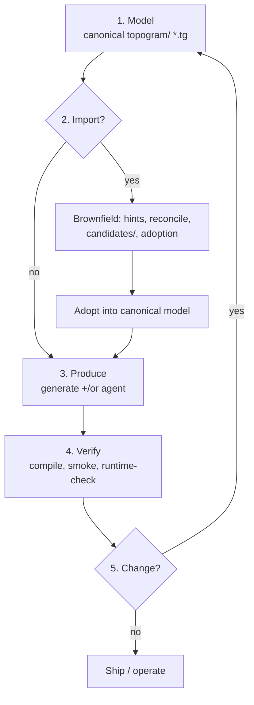

# Topogram

Topogram helps humans and agents evolve software safely: **one durable model** (`.tg`), **many realized surfaces** (APIs, web clients, persistence artifacts), **optional brownfield import**, and **verification** tied to the same intent.

At early stage, **start here** — then read [docs/overview.md](./docs/overview.md) for motivation, limits, proof inventory, FAQ, and commands.

---

## Product workflow

**North star:** model durable intent → optionally **import** and **adopt** brownfield structure → **produce** (deterministic **generation** and/or **agent-assisted** edits) → **verify** → **evolve** the model and repeat.

Teams target **multiple stacks from one Topogram over time**. This repo proves that loop rigorously for a **subset** of stacks today; the matrix below separates **shipped** from **target**.




**Generate vs agent.** The **engine** owns deterministic realization (contracts, bundles, generator-owned code paths). **Agents** work from queries and bounded packets (plans, review material, edits across **maintained** boundaries). Canonical meaning lives in `.tg`; emitted outputs live under `artifacts/` and generated apps; hand-owned glue is explicit. See [docs/topogram-workspace-layout.md](./docs/topogram-workspace-layout.md).

### Where proofs live


| Location                         | Role                                                                                                           |
| -------------------------------- | -------------------------------------------------------------------------------------------------------------- |
| `**examples/generated/<app>/`**  | Reference apps in this repo. Golden fixtures + CI (`scripts/verify-generated-example.sh`).                     |
| `**examples/maintained/<app>/**` | Maintained proof apps (`scripts/verify-product-app.sh`).                                                       |
| `**examples/imported/**`         | Bridge only; bulk brownfield snapshots live in **[topogram-demo](https://github.com/attebury/topogram-demo)**. |


Generator regression **here** is not the same thing as imported breadth **there** — both matter.

### Capability matrix (honest)


| Surface class                                           | Generate (today)               | Agent-assisted            | Import story                    | CI verify (today)                  |
| ------------------------------------------------------- | ------------------------------ | ------------------------- | ------------------------------- | ---------------------------------- |
| HTTP API (Node, Hono)                                   | Yes (`hono-server`)            | Yes                       | Staged rehearsal + demo targets | Yes                                |
| HTTP API (Node, Express)                                | Yes (`express-server`)         | Yes                       | Same                            | Yes (parity vs Hono)               |
| Web (SvelteKit)                                         | Yes (`sveltekit-app`)          | Yes                       | Demo-scope trials               | Yes                                |
| Web (React / Vite)                                      | Yes (e.g. issues)              | Yes                       | Same                            | Yes                                |
| Persistence (Prisma / SQL / SQLite)                     | Yes                            | Yes                       | Partial                         | Yes                                |
| Native mobile / desktop (Swift, Kotlin, Bun desktop, …) | **No** first-class targets yet | Queries scope manual work | Trials / roadmap                | Not same as generated-runtime gate |


**Roadmap (target, not a repo promise):** additional projections or generator targets (e.g. Android, iOS, Bun-first) following the same loop once modeled. **Full native parity** (Xcode/Gradle builds on pinned SDKs) is **ops-gated in [topogram-demo](https://github.com/attebury/topogram-demo)** — see [examples/native](https://github.com/attebury/topogram-demo/tree/main/examples/native) — not default **topogram** CI.

---

## Documentation


| Doc                                                        | Use                                                                                                       |
| ---------------------------------------------------------- | --------------------------------------------------------------------------------------------------------- |
| **[docs/overview.md](./docs/overview.md)**                 | Full orientation: why, limits, proof points list, FAQ, getting started, verification scripts, repo layout |
| **[docs/README.md](./docs/README.md)**                     | Index of all docs by role                                                                                 |
| **[docs/product-workflow.md](./docs/product-workflow.md)** | Stable name in docs index; links here                                                                     |


---

## Quick start

Use Node 20+ (matches CI).

```bash
cd ./engine
npm run validate
npm run validate:issues
npm run validate:content-approval
```

See [docs/overview.md](./docs/overview.md#getting-started) for bundles, verification matrix, and brownfield rehearsal.

---

## License

Topogram is licensed under the Apache License 2.0. See [LICENSE](./LICENSE). Copyright is documented in [NOTICE](./NOTICE).