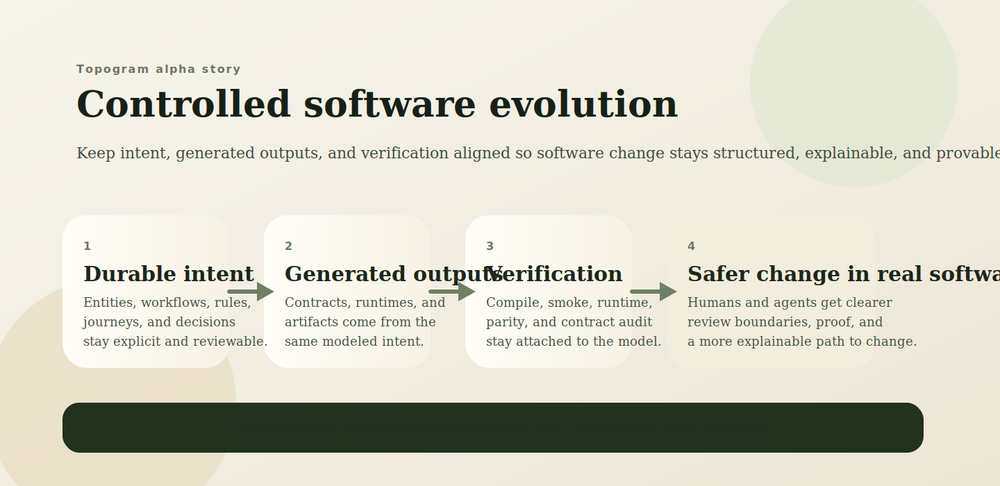
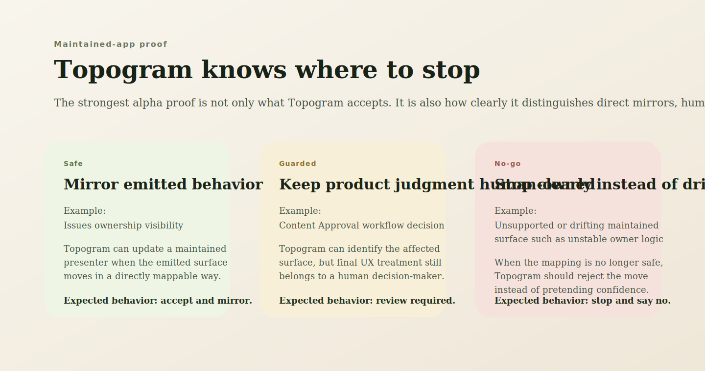
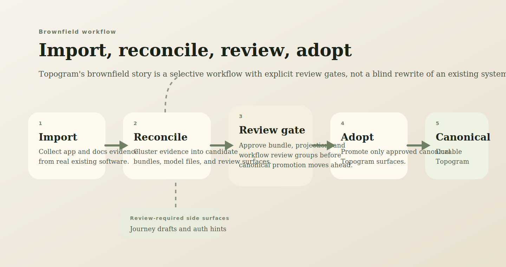

# Alpha Overview

This is the shortest visual walkthrough of Topogram's current alpha story.

It is designed to be shareable with skeptical evaluators and design partners who want one compact page before diving into the deeper proof docs.

## 1. The Wedge

Topogram helps humans and agents evolve software safely.

It keeps intent, generated outputs, and verification aligned so software change stays structured, explainable, and provable.

What this means in practice:

- durable intent stays explicit
- generated outputs stay tied to that intent
- verification stays attached to the same modeled source
- real software changes become easier to review and trust

## 2. The Strongest Alpha Proof

The clearest current alpha proof is not just that Topogram generates artifacts. It is that Topogram can guide change in maintained code, stage brownfield recovery for review, and distinguish what should be accepted, reviewed, or rejected.

That is the core alpha trust story:

- safe changes can be mirrored
- guarded changes keep product judgment human-owned
- no-go changes stop clearly instead of drifting
- maintained semantic changes can now be checked across multiple surfaces, not only one file at a time

For the deeper maintained-app proof, see:

- [examples/maintained/proof-app/proof/edit-existing-app.md](../examples/maintained/proof-app/proof/edit-existing-app.md)
- [examples/maintained/proof-app/proof/issues-cross-surface-alignment-story.md](../examples/maintained/proof-app/proof/issues-cross-surface-alignment-story.md)

## 3. Why Brownfield Matters

Topogram is not only a greenfield reference-app story.

It can also recover structure from real systems, reconcile that evidence into reviewable bundles, and selectively adopt approved meaning into canonical Topogram surfaces.

This is why the alpha is framed around controlled software evolution instead of “generate an app from scratch.”

The brownfield/operator path is also more readable now:

- import/adopt proposals show conservative maintained seam-review summaries
- `review-packet` and `proceed-decision` make the next query family and operator loop explicit
- the local brownfield rehearsal path now lives in `topogram`, while imported breadth and freshness stay in [topogram-demo](https://github.com/attebury/topogram-demo)

For the fuller brownfield flow, see:

- [docs/brownfield-import-roadmap.md](./brownfield-import-roadmap.md)
- [docs/confirmed-proof-matrix.md](./confirmed-proof-matrix.md)
- [docs/topogram-demo-ops.md](./topogram-demo-ops.md)

## 4. Current Boundary

Topogram's alpha claim is intentionally narrow:

- proven now:
  - maintained-app proof
  - brownfield recovery and staged adoption/review flow
  - generated examples and parity proofs
  - alpha-complete signed-token auth boundary
- not claimed yet:
  - production auth readiness
  - broad deployment hardening
  - universal domain or runtime generality
  - unlimited automation of maintained code changes

For the current public claim boundary, see:

- [docs/proof-points-and-limits.md](./proof-points-and-limits.md)

## 5. Best Next Reads

If this overview feels credible, read these next:

1. [docs/evaluator-path.md](./evaluator-path.md)
2. [examples/maintained/proof-app/proof/edit-existing-app.md](../examples/maintained/proof-app/proof/edit-existing-app.md)
3. [docs/agent-planning-evaluator-path.md](./agent-planning-evaluator-path.md)
4. [docs/confirmed-proof-matrix.md](./confirmed-proof-matrix.md)
5. [docs/proof-points-and-limits.md](./proof-points-and-limits.md)
