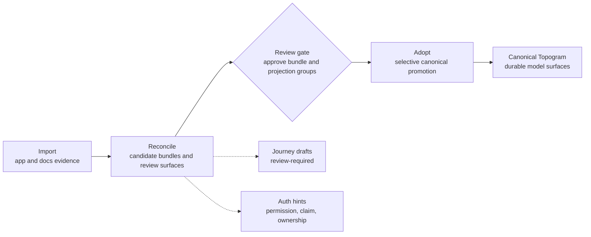

# Brownfield Import Roadmap

## Goal

Support a complete brownfield flow from app discovery to selective canonical Topogram adoption.

The desired loop is:

1. collect structural and intent evidence from the app
2. infer candidate model, doc, UI, and workflow artifacts under `candidates/`
3. report gaps and conflicts against any existing Topogram
4. reconcile candidates into reviewable concept bundles
5. selectively adopt approved candidates into canonical `topogram/` files

## Alpha Bar

For alpha, the brownfield story has two distinct proof surfaces:

- `topogram` proves the deterministic staged import/adopt rehearsal and the planning/operator loop on the canonical local fixture
- `topogram-demo` proves active imported breadth on real external systems

The local alpha rehearsal inside `topogram` is:

1. `bash ./scripts/run-brownfield-rehearsal.sh`
2. `bash ./scripts/verify-brownfield-rehearsal.sh`
3. `bash ./scripts/verify-agent-planning.sh`

The active imported breadth bar remains the current 5-target set in [topogram-demo](https://github.com/attebury/topogram-demo).

## Core Workflows

### Import

- `import app --from db,api,ui,workflows`
- `import docs`

### Compare

- `report gaps`

### Reconcile

- `reconcile`
- `reconcile adopt <selector>`

### Queue / Status

- `adoption status`

## Workflow Matrix

### `import app`

Purpose:

- infer candidate evidence from app code and structural sources

Primary outputs:

- `candidates/app/db/*`
- `candidates/app/api/*`
- `candidates/app/ui/*`
- `candidates/app/workflows/*`

### `import docs`

Purpose:

- extract terms, workflows, and reports from existing documentation

Primary outputs:

- `candidates/docs/*`

### `report gaps`

Purpose:

- compare imported evidence against canonical Topogram

Should surface:

- missing entities
- missing capabilities
- missing screens
- missing workflows
- field mismatches
- enum mismatches
- route mismatches
- workflow representation gaps
- docs-vs-model mismatches

### `reconcile`

Purpose:

- cluster imported evidence into concept bundles
- generate candidate model files
- generate bundle review surfaces
- generate adoption plan and dependency groups

### `reconcile adopt`

Purpose:

- selectively promote safe canonical artifacts
- respect blocked review states
- support explicit approval via `from-plan`
- optionally refresh already-adopted machine-managed canonical files when imported candidates improve

Supported selectors today include:

- `from-plan`
- `enums`
- `shapes`
- `entities`
- `capabilities`
- `docs`
- `journeys`
- `workflows`
- `ui`
- `bundle:<slug>`
- `projection-review:<id>`
- `ui-review:<id>`
- `workflow-review:<id>`
- `bundle-review:<slug>`

Refresh behavior:

- default adoption remains conservative and does not overwrite existing canonical files
- `reconcile adopt ... --refresh-adopted --write` may refresh existing canonical files only when:
  - the selector still targets the same adopted concept
  - the canonical file still appears machine-managed/imported
  - the refreshed contents come from the same candidate source path
- this is intended for importer-quality improvements, not for arbitrary canonical rewrites

### `adoption status`

Purpose:

- show which bundle is closest to adoption
- surface blockers, review groups, and recommended next actions

## Brownfield Defaults

### Workspace bootstrap

If a repo has no `topogram/` yet:

- read-only workflows should not create it
- write-mode import workflows should bootstrap it automatically

### Source selection

Default behavior should discover sources automatically, but strongly prefer:

1. canonical handwritten sources
2. framework-specific sources
3. generic fallbacks
4. generated and deploy artifacts only as fallback

### Adoption safety

Topogram should stop at canonical model adoption in this phase.

It should not automatically rewrite:

- existing canonical projections
- realized app code
- generated deployment/runtime outputs

Those should be surfaced as impacts, patches, and review groups instead.

## Near-Term Next Steps

- improve concept typing for non-resource UI flows
- add conservative UI flow recovery metadata so non-CRUD screens, routes, and actions can group around one user-goal surface without over-merging weak matches
- expand extractor coverage to more backend and UI stacks
- improve docs noise filtering
- add projection patch planning as a stronger review surface
- run more real brownfield trials outside the curated examples
- harden maintained seam candidate inference with conservative scoring and trial-derived regression fixtures so import/adopt review stays precise on real brownfield structures
- keep one positive imported maintained-boundary proof (`supabase-express-api`) and one negative/no-guessing imported proof (`eShopOnWeb`) green in `topogram-demo` as part of the current active imported claim set
- keep one server-rendered UI flow proof (`eShopOnWeb` basket) and one mobile UI flow proof (`clean-architecture-swiftui` country) green in `topogram-demo` as supporting regression evidence, not as a reason to widen the product-repo local rehearsal scope

## Brownfield journey drafts

Journeys now belong in the brownfield flow, but they should still come after the structural model surfaces.

Preferred order:

1. `import app`
2. `import docs`
3. `report gaps`
4. `reconcile`
5. selective `reconcile adopt`
6. review candidate journey drafts
7. promote reviewed journeys into canonical `topogram/docs/journeys/*.md`

Current behavior:

- `reconcile` can now emit review-required candidate journey drafts inside bundle review outputs under `candidates/reconcile/model/bundles/*/docs/journeys/*.md`
- those draft journeys participate in the normal bundle README, report, and adoption-plan surfaces
- `generate journeys` still exists as a separate workflow for drafting missing journeys from an already-resolved Topogram graph
- `reconcile adopt journeys ... --write` now promotes only candidate journey docs into canonical `topogram/docs/journeys/*.md`

Current boundary:

- journey drafts are inferred and review-required
- journey drafts are not auto-promoted into canonical docs
- canonical journey promotion remains an explicit human-reviewed step

## Brownfield auth hints

Permission-aware, claim-aware, and ownership-aware auth modeling now belong in the brownfield flow too, but they remain explicitly review-driven.

Preferred order:

1. `import app`
2. `import docs`
3. `report gaps`
4. `reconcile`
5. review bundle-level auth hints and projection patch candidates
6. approve the affected `projection-review:<id>` group
7. `reconcile adopt from-plan --write`

Current behavior:

- `reconcile` can now infer review-required bundle-level permission hints such as `permission issues.update`
- `reconcile` can now infer review-required bundle-level auth claim hints such as `claim reviewer = true`
- `reconcile` can now infer review-required bundle-level ownership hints such as `ownership owner_or_admin ownership_field assignee_id`
- those hints appear in bundle READMEs, reconcile report summaries, and next-best-action guidance
- when imported role evidence lines up with auth-sensitive capabilities, `reconcile` also emits review-focused auth role guidance so operators can validate the likely participant side of the recovered auth story
- when a hint lines up with projection-sensitive imported capabilities, `reconcile` emits projection auth patch candidates inside the normal projection patch surface
- the reconcile adoption plan now includes:
  - `apply_projection_permission_patch` for inferred permission rules
  - `apply_projection_auth_patch` for inferred claim rules
  - `apply_projection_ownership_patch` for inferred ownership rules
- those items target canonical projection files like `topogram/projections/proj-api.tg`
- once the relevant projection review group is approved, `reconcile adopt from-plan --write` can promote the imported capability and patch the canonical projection with inferred `http_authz` permission, claim, and ownership rules, and `ui_visibility` permission or claim rules where available
- `query auth-hints <path>` now gives a compact auth-review landscape over those same reconcile artifacts when operators want the auth state without reading the full reconcile report
- `query auth-review-packet <path> --bundle <slug>` now gives a bundle-scoped auth review packet before projection review and `from-plan` adoption

Current boundary:

- auth hints are inferred and review-required
- auth-sensitive role guidance is inferred and review-focused, but still does not auto-promote roles or role links by itself
- auth hints do not auto-promote directly into canonical auth modeling
- canonical projection auth rules are only changed after explicit projection review approval plus a `from-plan` adoption write
