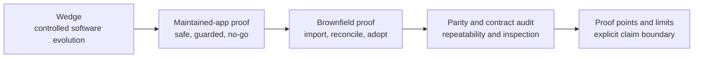
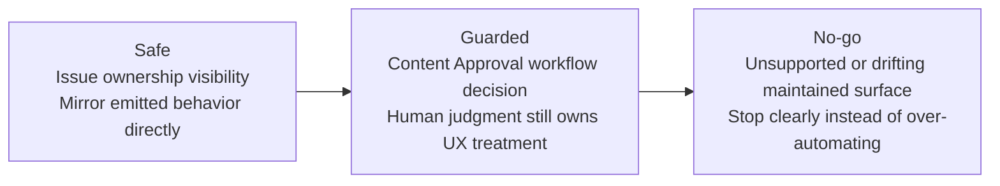

# Evaluator Path

This is the canonical evaluator flow for Topogram.

If you are asking whether Topogram is real, useful, or trustworthy enough to keep looking at, follow this path in order.

## 1. Start with the wedge

Read:

- [README.md](/Users/attebury/Documents/topogram/README.md)
- [alpha-overview.md](/Users/attebury/Documents/topogram/docs/alpha-overview.md)
- [proof-points-and-limits.md](/Users/attebury/Documents/topogram/docs/proof-points-and-limits.md)

The key question to answer here is:

- does Topogram have a specific first job-to-be-done?

The intended answer is:

- Topogram helps humans and agents evolve software safely by keeping intent, generated outputs, and verification aligned.

## 2. See the maintained-app proof

Read:

- [product/app/proof/edit-existing-app.md](/Users/attebury/Documents/topogram/product/app/proof/edit-existing-app.md)
- [product/app/README.md](/Users/attebury/Documents/topogram/product/app/README.md)

The key question here is:

- can Topogram help with real maintained code instead of only generating reference apps?

Before moving on, make one seam-aware check explicit:

- which maintained seam moved?
- which output owns that seam?
- why is the change safe, guarded, or no-go?
- which maintained or generated checks go with that seam?

The shortest live path is:

1. `node ./engine/src/cli.js query maintained-boundary ./examples/content-approval/topogram`
2. `node ./engine/src/cli.js query maintained-drift ./examples/content-approval/topogram --from-topogram ./examples/todo/topogram`
3. `node ./engine/src/cli.js query seam-check ./examples/content-approval/topogram --from-topogram ./examples/todo/topogram`

Presenter notes for this stop:

- seam-awareness is not just file tagging; it ties outputs, seams, emitted dependencies, proof stories, and verification targets together
- the strongest current comparison direction is Topogram change to maintained drift and seam impact
- the reverse direction is still conservative and evidence-backed, not full semantic understanding of arbitrary maintained code
- in multi-output repos, seams are grouped under outputs so drift, conformance, and verification can differ by output

If you want the fuller objection-handling version of this stop, see [skeptical-evaluator.md](/Users/attebury/Documents/topogram/docs/skeptical-evaluator.md).

## 3. Inspect one safe, one guarded, and one no-go change

Read these together:

- safe accepted change:
  - [product/app/proof/issues-ownership-visibility-story.md](/Users/attebury/Documents/topogram/product/app/proof/issues-ownership-visibility-story.md)
- guarded/manual-decision change:
  - [product/app/proof/content-approval-workflow-decision-story.md](/Users/attebury/Documents/topogram/product/app/proof/content-approval-workflow-decision-story.md)
- clearly rejected or unsupported change:
  - [product/app/proof/issues-ownership-visibility-drift-story.md](/Users/attebury/Documents/topogram/product/app/proof/issues-ownership-visibility-drift-story.md)
  - [product/app/proof/todo-project-owner-unsupported-change-story.md](/Users/attebury/Documents/topogram/product/app/proof/todo-project-owner-unsupported-change-story.md)

The key question here is:

- does Topogram only automate, or can it also tell an agent where to stop?

## 4. Check brownfield evidence

Read:

- [confirmed-proof-matrix.md](/Users/attebury/Documents/topogram/docs/confirmed-proof-matrix.md)
- [agent-planning-evaluator-path.md](/Users/attebury/Documents/topogram/docs/agent-planning-evaluator-path.md)

The key question here is:

- is this only a greenfield story?
- can Topogram give one agent or several agents a bounded, review-aware operating path without becoming a black-box scheduler?

## 5. Check verification and limits

Read:

- [testing-strategy.md](/Users/attebury/Documents/topogram/docs/testing-strategy.md)
- [parity-proof-matrix.md](/Users/attebury/Documents/topogram/docs/parity-proof-matrix.md)
- [parity-evaluator-path.md](/Users/attebury/Documents/topogram/docs/parity-evaluator-path.md)
- [issues-parity-evaluator-path.md](/Users/attebury/Documents/topogram/docs/issues-parity-evaluator-path.md)
- [issues-contract-auditor-path.md](/Users/attebury/Documents/topogram/docs/issues-contract-auditor-path.md)
- [agent-planning-evaluator-path.md](/Users/attebury/Documents/topogram/docs/agent-planning-evaluator-path.md)
- [auth-evaluator-path.md](/Users/attebury/Documents/topogram/docs/auth-evaluator-path.md)
- [auth-profile-bearer-jwt-hs256.md](/Users/attebury/Documents/topogram/docs/auth-profile-bearer-jwt-hs256.md)
- [bearer-demo-launch-checklist.md](/Users/attebury/Documents/topogram/docs/bearer-demo-launch-checklist.md)
- [skeptical-evaluator.md](/Users/attebury/Documents/topogram/docs/skeptical-evaluator.md)

The key questions here are:

- how is Topogram validated?
- what exactly does Topogram prove on auth?
- what exactly does Topogram prove today on target parity, and where does that parity stop?
- what is still self-referential or incomplete?
- what is not launch-ready?

## What We Can Prove Today

| Claim | Status | Best evidence |
| --- | --- | --- |
| Topogram can model, generate, and verify multiple example domains | Proven now | [README.md](/Users/attebury/Documents/topogram/README.md), [testing-strategy.md](/Users/attebury/Documents/topogram/docs/testing-strategy.md) |
| Topogram can recover structure from brownfield systems | Proven now | [confirmed-proof-matrix.md](/Users/attebury/Documents/topogram/docs/confirmed-proof-matrix.md) |
| Topogram can guide change in hand-maintained app surfaces | Proven now | [product/app/proof/edit-existing-app.md](/Users/attebury/Documents/topogram/product/app/proof/edit-existing-app.md) |
| Topogram can distinguish safe, guarded, and no-go change boundaries | Proven now | maintained-app proof stories under [product/app/proof](/Users/attebury/Documents/topogram/product/app/proof) |
| Topogram is already proven across all domain shapes | Partially proven | current examples are meaningful but not exhaustive |
| Topogram verification is fully independent of generated outputs | Partially proven | evaluator-facing maintained-app contract review exists, but deeper independence is still needed |
| Topogram proves alpha-complete modeled auth with signed tokens, but not production auth readiness | Proven now | [auth-profile-bearer-jwt-hs256.md](/Users/attebury/Documents/topogram/docs/auth-profile-bearer-jwt-hs256.md) |
| Topogram is production-ready for auth and broad deployment claims | Not launch-ready | [proof-points-and-limits.md](/Users/attebury/Documents/topogram/docs/proof-points-and-limits.md), [bearer-demo-launch-checklist.md](/Users/attebury/Documents/topogram/docs/bearer-demo-launch-checklist.md) |

## 5-10 Minute Demo Path

Use this short path for a live demo:

1. Open [README.md](/Users/attebury/Documents/topogram/README.md) and state the wedge in one sentence.
2. Show [product/app/proof/edit-existing-app.md](/Users/attebury/Documents/topogram/product/app/proof/edit-existing-app.md) as the “Topogram touches maintained code” proof.
3. Show one seam-aware maintained query sequence:
   - `query maintained-boundary`
   - `query maintained-drift`
   - `query seam-check` or `query maintained-conformance`
4. Show the three boundary categories:
   - [issues-ownership-visibility-story.md](/Users/attebury/Documents/topogram/product/app/proof/issues-ownership-visibility-story.md)
   - [content-approval-workflow-decision-story.md](/Users/attebury/Documents/topogram/product/app/proof/content-approval-workflow-decision-story.md)
   - [issues-ownership-visibility-drift-story.md](/Users/attebury/Documents/topogram/product/app/proof/issues-ownership-visibility-drift-story.md)
5. Show [confirmed-proof-matrix.md](/Users/attebury/Documents/topogram/docs/confirmed-proof-matrix.md) as the brownfield breadth proof.
6. For import/adopt rehearsal, use:
   - `node ./engine/scripts/build-adoption-plan-fixture.mjs ./engine/tests/fixtures/import/incomplete-topogram/topogram --scenario projection-impact --json`
   - then `query import-plan` against the generated staged workspace
7. For planning rehearsal, use:
   - `query next-action`
   - `query single-agent-plan`
   - `query multi-agent-plan --mode import-adopt`
   - `query work-packet --mode import-adopt --lane <id>`
   - or just run `bash /Users/attebury/Documents/topogram/scripts/verify-agent-planning.sh`
8. End on [proof-points-and-limits.md](/Users/attebury/Documents/topogram/docs/proof-points-and-limits.md) to keep claims honest.
