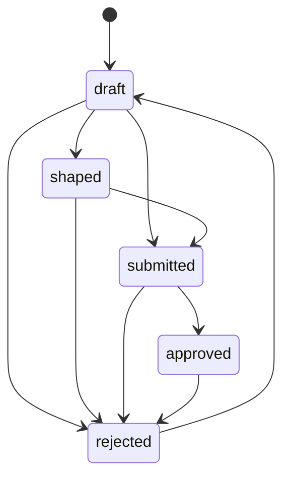
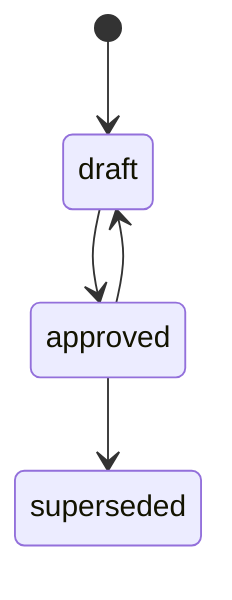
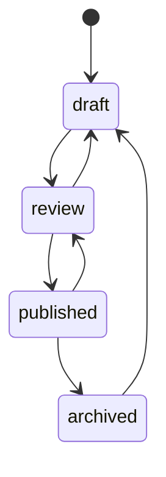

# SDLC lifecycles

Per-kind state machines and Definition of Done (DoD) rules. The state
machines are enforced at `topogram sdlc transition` time; the DoD rules
also fire on `topogram sdlc check` so drift surfaces independently.

## Pitch



A pitch may skip `shaped` and go straight to `submitted` for small or
obvious work. `rejected` is archive-eligible.

DoD highlights:
- Leaving `draft` requires `appetite` and `problem` filled
- `approved` warns if `affects` is empty (no downstream impact recorded)

## Requirement

```mermaid
stateDiagram-v2
  [*] --> draft
  draft --> in-review
  in-review --> approved
  in-review --> draft
  approved --> superseded
  approved --> in-review
```

Requirements are always-live: even `superseded` ones stay in the active
workspace because tasks may still reference them in the traceability
matrix. Archive policy: never.

DoD highlights:
- `in-review` requires at least one `affects` target
- `approved` requires at least one acceptance criterion
- `superseded` warns if no `supersedes` pointer (loses traceability)

## Acceptance criterion



Always-live (like requirements). DoD requires `requirement` is set; warns
if approving while parent requirement is still draft.

## Task

```mermaid
stateDiagram-v2
  [*] --> unclaimed
  unclaimed --> claimed
  claimed --> in-progress
  claimed --> blocked
  claimed --> unclaimed
  in-progress --> done
  in-progress --> blocked
  in-progress --> claimed
  blocked --> claimed
  blocked --> in-progress
```

`done` is archive-eligible.

DoD highlights:
- `claimed`/`in-progress`/`done` require `claimed_by`
- `in-progress` blocks if any `blocked_by` task isn't `done`
- `done` warns if `satisfies` or `acceptance_refs` is empty (except for
  `documentation` and `review` work types)

## Bug

```mermaid
stateDiagram-v2
  [*] --> open
  open --> in-progress
  open --> wont-fix
  in-progress --> fixed
  in-progress --> open
  in-progress --> wont-fix
  fixed --> verified
  fixed --> in-progress
  fixed --> wont-fix
  verified --> in-progress
  wont-fix --> open
```

Both `verified` and `wont-fix` are archive-eligible.

DoD highlights:
- `fixed` and `verified` require `fixed_in` (the task that fixed it)
- `verified` requires `fixed_in_verification` (proof the fix landed)
- `wont-fix` warns if `reproduction` is empty

## Document



`published` returns to `review` when a linked component changes — the
staleness signal.

DoD highlights:
- `review`/`published` require `title`
- `published` warns if `app_version` is missing or `confidence` is `low`

## Drift detection

`topogram sdlc check` reads the history sidecar and compares the last
recorded transition's `to` against the artifact's current `status`. A
mismatch indicates the artifact was edited outside the CLI — surfaced as
a warning in the report. `--strict` exits non-zero on warnings.

## Status filtering defaults

The default board (`topogram generate sdlc-board`) hides:
- `pitch.rejected`
- `task.done` (archived)
- `bug.verified`, `bug.wont-fix` (both archived)
- `document.archived`

`--include-archived` widens the board to include frozen entries;
`--status <list>` overrides the per-kind default with an explicit set.

## Reference

- `engine/src/sdlc/transitions/{kind}.js` — per-kind `LEGAL_TRANSITIONS`
  map and `validateTransition`
- `engine/src/sdlc/dod/{kind}.js` — DoD rules
- `engine/src/sdlc/history.js` — sidecar I/O and drift detection
- `engine/src/sdlc/status-filter.js` — default-active filtering rules
