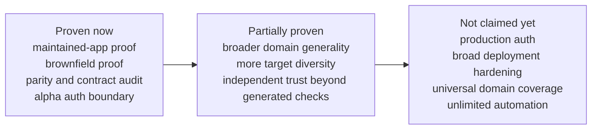
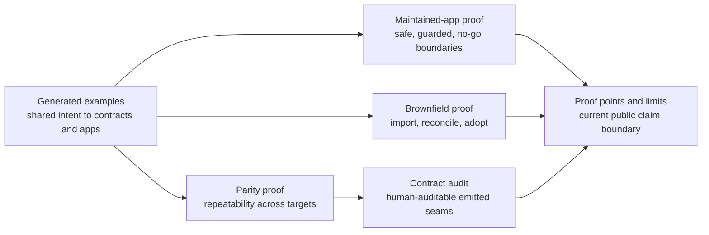
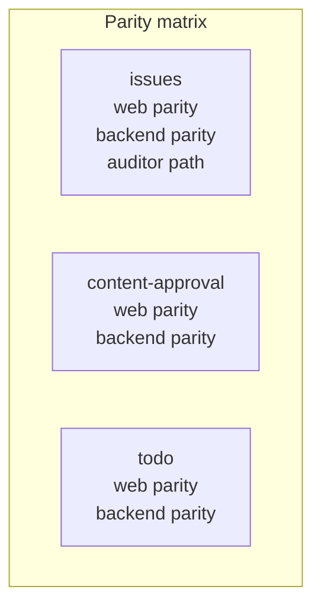

# Proof Points And Limits

This page is the current public claim boundary for Topogram.

It is intended to answer two evaluator questions quickly:

1. what can Topogram prove today?
2. what is still incomplete or explicitly out of scope?

## Current Wedge

The strongest current Topogram wedge is controlled software evolution for humans and agents.

Topogram is most credible today when framed as a system that helps teams:

- understand existing software structure through brownfield recovery
- evolve generated and hand-maintained surfaces from shared intent
- keep emitted contracts and verification aligned with those changes
- stop clearly when a change should remain manual

## What We Can Prove Today

### Proven now

- model-driven contracts, generated artifacts, and runtime bundles across multiple example domains
- verification attached to modeled intent through compile, smoke, and runtime-check paths
- brownfield recovery and closed adoption proofs across a broad set of real stacks
- hand-maintained app evolution proofs that follow emitted Topogram artifacts rather than raw model text
- explicit no-go behavior for unsafe or ambiguous changes in the maintained-app proof package
- explicit single-agent planning, import-adopt multi-agent decomposition, and bounded work-packet assignment surfaces for external agent systems

### Partially proven

- broader domain generality beyond the current example set
- broad multi-target support across many web/runtime combinations
- independent validation beyond the generated verification stack
- long-term `.tg` ergonomics at significantly larger product scale
- broader multi-agent execution patterns beyond brownfield `import-adopt`

### Not launch-ready

- production-grade auth
- broad production-hardening claims across deployment environments
- a claim that Topogram is already proven for all domain shapes
- a claim that all maintained-app changes can be safely automated
- a claim that Topogram is a hosted scheduler, orchestration runtime, or authoritative agent messaging system

## Proof Inventory

### Greenfield and generated proof

- [examples/todo](../examples/todo)
- [examples/issues](../examples/issues)
- [examples/content-approval](../examples/content-approval)

These establish that Topogram can model, generate, and verify multiple domains and stacks from shared semantics.

### Brownfield proof

- [docs/confirmed-proof-matrix.md](./confirmed-proof-matrix.md)

This is the strongest current evidence that Topogram is not only a greenfield reference-app story.

### Planning proof

- [docs/agent-planning-evaluator-path.md](./agent-planning-evaluator-path.md)
- [docs/agent-query-contract.md](./agent-query-contract.md)

These establish the current planning boundary:

- one explicit default single-agent operating loop
- one optional multi-agent decomposition for brownfield `import-adopt`
- one bounded work-packet surface per lane for external agent systems

They do not establish a live scheduler or autonomous orchestration runtime.

### Hand-maintained app evolution proof

- [product/app/proof/edit-existing-app.md](../product/app/proof/edit-existing-app.md)
- [product/app/proof/issues-cross-surface-alignment-story.md](../product/app/proof/issues-cross-surface-alignment-story.md)
- [product/app/proof/issues-ownership-visibility-story.md](../product/app/proof/issues-ownership-visibility-story.md)
- [product/app/proof/issues-ownership-visibility-drift-story.md](../product/app/proof/issues-ownership-visibility-drift-story.md)
- [product/app/proof/content-approval-workflow-decision-story.md](../product/app/proof/content-approval-workflow-decision-story.md)
- [product/app/proof/todo-project-owner-unsupported-change-story.md](../product/app/proof/todo-project-owner-unsupported-change-story.md)

These establish that Topogram’s value is not only “generate an app.” It can also help decide:

- what changed
- what emitted surfaces moved
- what a maintained app should mirror
- which governed seam and output are implicated
- which emitted dependencies and verification targets anchor that seam
- what should stay manual or be rejected

The current maintained proof is intentionally seam-aware, but still conservative:

- it proves maintained guidance through explicit seams, emitted dependencies, proof stories, and verification targets
- it now adds lightweight implementation corroboration through maintained-module files, proof-story files, maintained-file scope, dependency-token matches, and seam-kind verification coverage
- it does not claim full semantic understanding of arbitrary maintained code

### Verification strategy

- [docs/testing-strategy.md](./testing-strategy.md)

This is the current explanation of how model validity, emitted artifacts, runtime bundles, and maintained-app behavior are verified.

### Parity proof matrix

- [docs/parity-proof-matrix.md](./parity-proof-matrix.md)

This is the compact inventory of what parity is already proven now, and what remains only partially proven.

### First multi-target proof

- [docs/multi-target-proof-issues.md](./multi-target-proof-issues.md)

This is the first explicit proof that one canonical domain model can preserve shared UI semantics across two web realizations.

### Second multi-target proof

- [docs/multi-target-proof-content-approval.md](./multi-target-proof-content-approval.md)

This is the second explicit proof that the same parity seam can hold in a different, workflow-heavy domain with claim-aware auth pressure.

### Third multi-target proof

- [docs/multi-target-proof-todo.md](./multi-target-proof-todo.md)

This is the third explicit proof that the same web parity seam also holds in the smaller reference domain.

### First multi-runtime proof

- [docs/multi-runtime-proof-issues.md](./multi-runtime-proof-issues.md)

This is the first explicit proof that one canonical domain model can preserve shared API semantics across two generated backend runtime targets.

### Second multi-runtime proof

- [docs/multi-runtime-proof-content-approval.md](./multi-runtime-proof-content-approval.md)

This is the second explicit proof that the same backend parity seam can hold in a different, workflow-heavy domain with claim-aware auth pressure.

### Third multi-runtime proof

- [docs/multi-runtime-proof-todo.md](./multi-runtime-proof-todo.md)

This is the third explicit proof that the same backend parity seam also holds in the smaller reference domain.

### Auth limitation boundary

- [docs/auth-profile-bearer-jwt-hs256.md](./auth-profile-bearer-jwt-hs256.md)
- [docs/auth-profile-bearer-demo.md](./auth-profile-bearer-demo.md)
- [docs/bearer-demo-launch-checklist.md](./bearer-demo-launch-checklist.md)

Use these as the authority for what Topogram does and does not prove today on auth.

## Known Limits

Topogram is still early. The strongest honest caveats are:

- the current examples are meaningful, but they do not prove all domain shapes
- the current verification story is strong, but still partly generated by the same system it validates
- maintained-app evolution is proven in narrow, concrete scenarios, not as an unlimited automation promise
- seam-aware maintained conformance and seam checks are evidence-backed and conservative, not deep behavioral proof of every maintained implementation
- alpha auth is proven around signed tokens, modeled auth semantics, generated enforcement, generated UI visibility, and brownfield auth review/adoption
- production auth, session or cookie auth, identity-provider integration, rotation or revocation lifecycle, production deployment guarantees, and broad enterprise readiness remain outside the current alpha claim boundary

## Next Trust-Building Target

The next major proof target after these explicit parity proofs across `issues`, `content-approval`, and `todo` should be one additional framework pair, runtime seam, or domain shape beyond the current React/SvelteKit and Hono/Express coverage.

That is now the clearest next answer to the “too example-shaped” critique without overclaiming generality today.

## Invite-Led Alpha Readiness

The current invite-led alpha audience and contact path are documented here:

- [docs/design-partner-profile.md](./design-partner-profile.md)
- [docs/invite-led-alpha.md](./invite-led-alpha.md)
