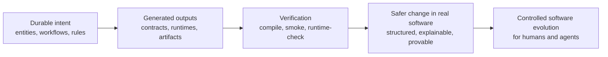
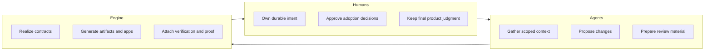
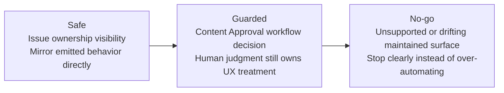
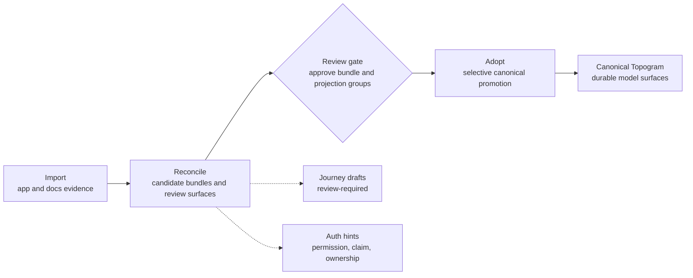
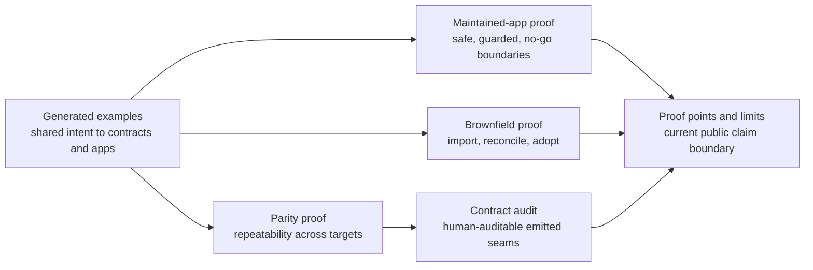
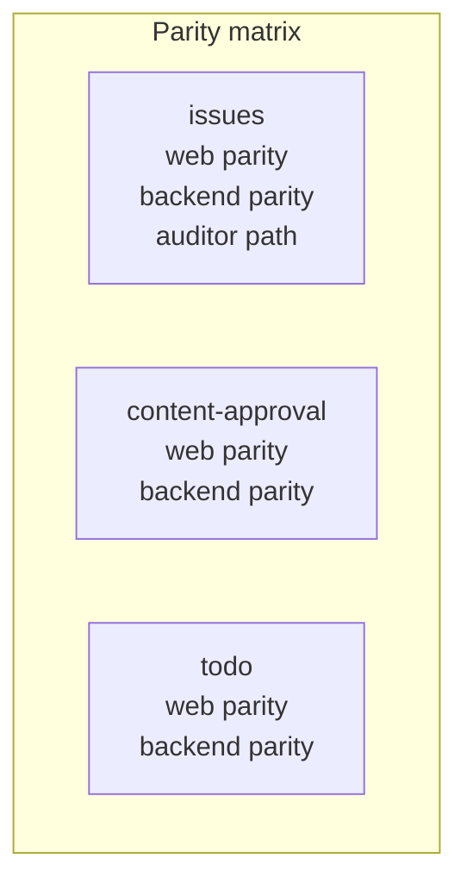
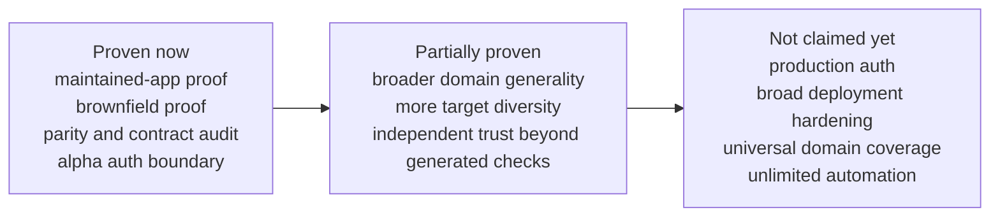

# Visual Explanation Path

This page collects the first doc-native visual package for Topogram's alpha story.

It is optimized for skeptical evaluators. The goal is not brand polish. The goal is to make the current wedge, proof surfaces, and claim boundary easier to understand quickly.

For the polished launch-facing variants of the three highest-value diagrams, see:

- [docs/assets/launch-graphics/hero-wedge.svg](/Users/attebury/Documents/topogram/docs/assets/launch-graphics/hero-wedge.svg)
- [docs/assets/launch-graphics/change-boundary.svg](/Users/attebury/Documents/topogram/docs/assets/launch-graphics/change-boundary.svg)
- [docs/assets/launch-graphics/brownfield-reconcile-flow.svg](/Users/attebury/Documents/topogram/docs/assets/launch-graphics/brownfield-reconcile-flow.svg)
- [visual-style-notes.md](/Users/attebury/Documents/topogram/docs/visual-style-notes.md)

## 1. Hero Wedge

Primary home:
- [README.md](/Users/attebury/Documents/topogram/README.md)

## 2. Human / Agent / Engine Boundary

Primary home:
- [README.md](/Users/attebury/Documents/topogram/README.md)

## 3. Safe / Guarded / No-Go Boundary

Primary homes:
- [docs/evaluator-path.md](/Users/attebury/Documents/topogram/docs/evaluator-path.md)
- [product/app/proof/edit-existing-app.md](/Users/attebury/Documents/topogram/product/app/proof/edit-existing-app.md)

## 4. Brownfield Reconcile Flow

Primary home:
- [docs/brownfield-import-roadmap.md](/Users/attebury/Documents/topogram/docs/brownfield-import-roadmap.md)

## 5. Proof Surface Map

Primary homes:
- [docs/evaluator-path.md](/Users/attebury/Documents/topogram/docs/evaluator-path.md)
- [docs/proof-points-and-limits.md](/Users/attebury/Documents/topogram/docs/proof-points-and-limits.md)

## 6. Parity Proof Matrix

Primary home:
- [docs/proof-points-and-limits.md](/Users/attebury/Documents/topogram/docs/proof-points-and-limits.md)

## 7. Alpha Boundary

Primary home:
- [docs/proof-points-and-limits.md](/Users/attebury/Documents/topogram/docs/proof-points-and-limits.md)
