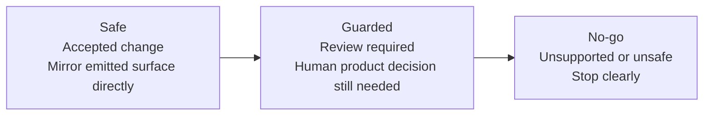

# Edit Existing App Proof

## Goal

Prove that Topogram can inform a hand-maintained app update, not just generate a fresh app.

This proof is the clearest current answer to the Topogram wedge:

- humans and agents can evolve software more safely when intent, emitted contracts, and verification remain aligned

## Seam-Oriented Framing

This proof package is now intentionally seam-led.

The maintained-app claim is not just that a human-owned file changed. It is that:

- a governed seam moved
- that seam belongs to a specific maintained output
- emitted dependencies explain why the seam moved
- proof stories and verification targets explain whether the change is safe, guarded, or no-go

For alpha, this is the maintained boundary vocabulary that matters most:

- `maintained_app` is the main maintained output
- seams inside that output explain where emitted semantics meet human-owned implementation
- seam-aware queries show the same boundary from the operator side

## Current Controlled Change

The strongest current proof uses the `content-approval` example.

Topogram change:

- `article_status` now includes `needs_revision`
- article detail contracts now expose `revision_requested_at`
- a new `cap_request_article_revision` workflow action exists
- editors resubmit through the existing update capability by setting the article back to `submitted`

Impacted surfaces:

- Content Approval API realization
- Content Approval DB realization
- Content Approval web realization
- generated Content Approval backend and React app
- maintained app presenter in `product/app/src/content-approval.js`
- maintained app workflow guard in `product/app/src/content-approval-change-guards.js`
- documented DB and maintained-app proof story in `product/app/proof/content-approval-db-change-story.md`

Primary seam framing for this change:

- seam: `seam_new_workflow_affordance_treatment`
- output: `maintained_app`
- emitted dependencies: `journey_editorial_review_and_revision`, `proj_web`
- review class: `manual_decision`

## Manual App Update

The hand-maintained Content Approval presenter now:

1. includes `revision_requested_at` in its summary output
2. exposes revision-request state in its detail view model
3. adds route/action metadata for request-revision and resubmission guidance
4. derives maintained detail-page actions and edit/request-revision form metadata from the workflow state
5. builds hand-maintained request-revision and resubmission submissions from workflow-aware form input
6. marks new workflow affordances as manual-decision cases when product judgment is still required
7. keeps its own route metadata and presenter logic outside generator ownership

## Secondary Proofs

The Todo example now carries two additive maintained-app proofs:

- task `priority`
  - task create/update input contracts accept `priority`
  - task detail and list outputs expose `priority`
  - maintained app presenter in `product/app/src/todo.js` renders the new field in both task detail and maintained task-card/list summaries
- project `owner_id`
  - project create/update input contracts accept `owner_id`
  - project detail output exposes the owner relationship
  - maintained app route metadata, summary output, and detail view model now render the project owner relationship

The Issues example now carries a maintained ownership-visibility proof:

- issue detail ownership visibility
  - emitted UI contract declares owner-or-admin visibility for update and close actions
  - emitted issue detail output still exposes `assignee_id` and lifecycle fields
  - maintained presenter in `product/app/src/issues.js` mirrors that behavior by showing edit/close affordances for owner or admin, and hiding them for non-owner viewers
- issue list/card visibility
  - emitted UI contract still points `issue_list` at `shape_output_issue_card`
  - emitted issue docs still describe the compact list/card output, including `assigneeId` and `priority`
  - maintained presenter in `product/app/src/issues.js` mirrors that card/list surface so “find it again in list and detail” remains part of the hand-maintained proof
- issue cross-surface alignment
  - emitted ownership semantics now have to stay aligned across detail action state, list/card summary state, and route/action metadata together
  - maintained presenter in `product/app/src/issues.js` now carries an explicit cross-surface alignment helper so those surfaces move as one governed seam family

## Maintained Change Boundary

The maintained-app proof package now has four explicit proof cases:

- accepted change
  - the emitted surface moves in a way the maintained app can mirror directly
  - example: [issues-ownership-visibility-story.md](./issues-ownership-visibility-story.md)
- cross-surface maintained alignment
  - one emitted semantic rule must stay coherent across multiple maintained surfaces inside the same governed output
  - example: [issues-cross-surface-alignment-story.md](./issues-cross-surface-alignment-story.md)
- guarded/manual-decision change
  - Topogram can identify the affected maintained surface, but final product treatment should stay human-owned
  - example: [content-approval-workflow-decision-story.md](./content-approval-workflow-decision-story.md)
- no-go or unsupported change
  - the system should stop clearly rather than over-automate
  - examples:
    - [issues-ownership-visibility-drift-story.md](./issues-ownership-visibility-drift-story.md)
    - [content-approval-unsupported-change-story.md](./content-approval-unsupported-change-story.md)
    - [todo-project-owner-unsupported-change-story.md](./todo-project-owner-unsupported-change-story.md)

This is the important maintained-app claim:

- Topogram can help say yes
- Topogram can help say not yet
- Topogram can also help say no

## Seam Map For The Current Proof Stories

Use this as the quick seam-aware map for the maintained proof package:

| Story | Seam | Output | Boundary |
| --- | --- | --- | --- |
| [issues-ownership-visibility-story.md](./issues-ownership-visibility-story.md) | `seam_maintained_presenter_structure` | `maintained_app` | safe / review-required |
| [issues-cross-surface-alignment-story.md](./issues-cross-surface-alignment-story.md) | `issues_cross_surface_alignment` seam family | `maintained_app` | cross-surface alignment / review-required |
| [content-approval-workflow-decision-story.md](./content-approval-workflow-decision-story.md) | `seam_new_workflow_affordance_treatment` | `maintained_app` | guarded / manual-decision |
| [issues-ownership-visibility-drift-story.md](./issues-ownership-visibility-drift-story.md) | `seam_owner_visibility_semantics_must_not_drift` | `maintained_app` | no-go |
| [todo-project-owner-unsupported-change-story.md](./todo-project-owner-unsupported-change-story.md) | `seam_ownership_retargeting_remains_manual` | `maintained_app` | no-go |

Example seam anatomy for the guarded Content Approval case:

- maintained modules:
  - `product/app/src/content-approval.js`
  - `product/app/src/content-approval-change-guards.js`
- emitted dependencies:
  - `journey_editorial_review_and_revision`
  - `proj_web`
- output verification targets:
  - `compile-check`
  - `smoke`
  - `runtime-check`

## Why This Counts

- the app code is hand-maintained
- the proof checks are run independently of the generated example app
- the Content Approval change is workflow-oriented, spanning model, contracts, generated runtime, and maintained-app presentation
- the change is driven by Topogram contract semantics rather than by copy/pasting generated files
- the proof package now shows accepted, guarded, and no-go change classes rather than only one happy path

## Independent Review Layer

For a human-auditable check outside the generated verification loop, use:

- [maintained-contract-review.md](./maintained-contract-review.md)

That artifact is intentionally hand-written. It helps a reviewer compare emitted artifacts and maintained surfaces directly without relying only on generated verification.

## How To Inspect This In Queries

The shortest seam-aware operator path for this proof is:

1. `node ./engine/src/cli.js query maintained-boundary ./examples/content-approval/topogram`
2. `node ./engine/src/cli.js query maintained-drift ./examples/content-approval/topogram --from-topogram ./examples/todo/topogram`
3. `node ./engine/src/cli.js query maintained-conformance ./examples/content-approval/topogram --from-topogram ./examples/todo/topogram`
4. `node ./engine/src/cli.js query seam-check ./examples/content-approval/topogram --from-topogram ./examples/todo/topogram`

Those seam-aware checks now corroborate the governed seam model with lightweight implementation evidence:

- maintained module files exist on disk
- proof story files exist on disk
- proof-story maintained files stay in seam or output scope when declared
- maintained modules still contain seam-relevant dependency tokens
- verification targets still cover the seam kind

For the import/adopt counterpart, use:

1. `node ./engine/scripts/build-adoption-plan-fixture.mjs ./engine/tests/fixtures/import/incomplete-topogram/topogram --scenario projection-impact --json`
2. `node ./engine/src/cli.js query import-plan <generated-topogram-root>`

## Acceptance

The proof passes when:

1. `compile-check` can import and exercise both presenter modules
2. `smoke` renders a Content Approval article summary that includes `revision_requested_at`
3. `runtime-check` confirms the Content Approval presenter plus maintained page/form/action models match the `needs_revision` Topogram detail shape expectations
4. the maintained workflow guard distinguishes stable workflow surfaces from new affordances that still require human UX judgment
5. the Todo priority, task list/card visibility, and project-owner proofs still pass
6. the Issues ownership-visibility, list/card visibility, and cross-surface alignment proofs still pass

For the fuller DB-plus-maintained-app narrative, see:

- [content-approval-db-change-story.md](./content-approval-db-change-story.md)
- [content-approval-unsupported-change-story.md](./content-approval-unsupported-change-story.md)
- [content-approval-workflow-decision-story.md](./content-approval-workflow-decision-story.md)
- [issues-cross-surface-alignment-story.md](./issues-cross-surface-alignment-story.md)
- [issues-ownership-visibility-story.md](./issues-ownership-visibility-story.md)
- [issues-ownership-visibility-drift-story.md](./issues-ownership-visibility-drift-story.md)
- [maintained-contract-review.md](./maintained-contract-review.md)
- [todo-project-owner-unsupported-change-story.md](./todo-project-owner-unsupported-change-story.md)
